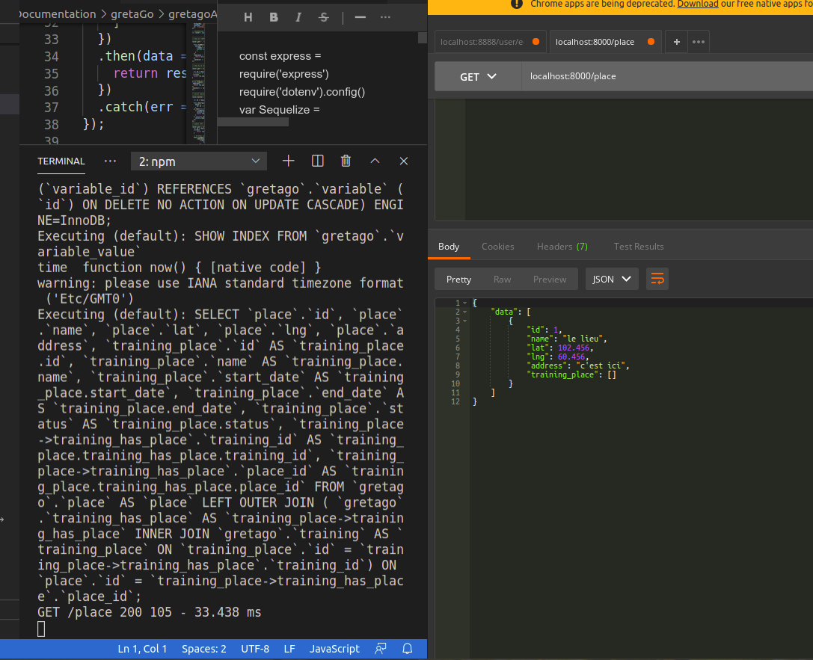

# RESERVE A L'API


N'oubliez pas: 
configurez le point .env avec vos paramètres et renommez le.
```npm install```
puis
```npm start```
après vous pouvez tester les methodes avec PostMan

Du coup pensez à peupler votre bdd fraichement importée pour avoir des réponses concrètes

